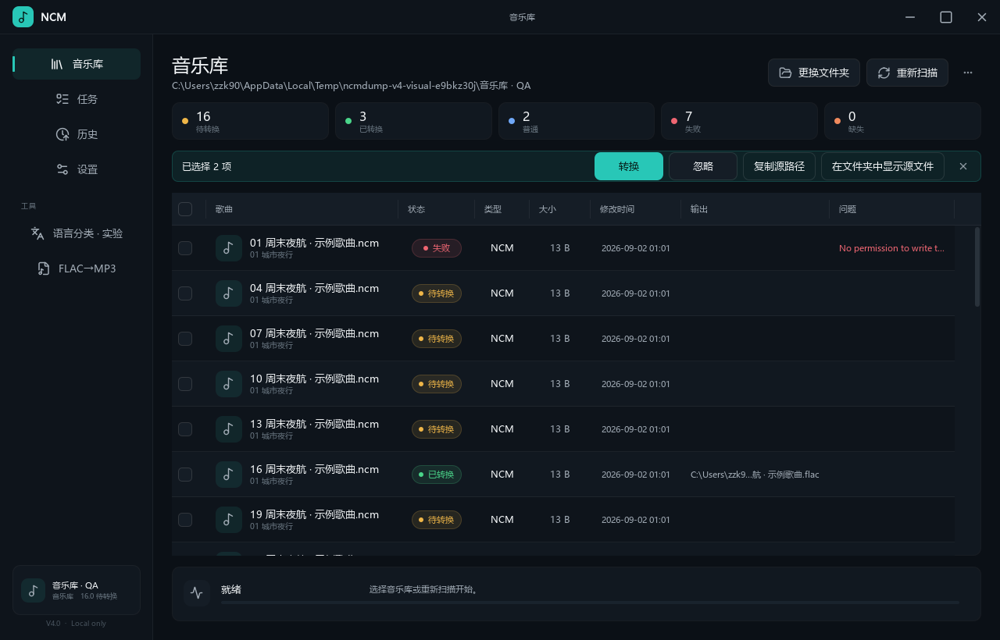

# NCM 音乐库转换器 V4.0




这是一个基于 [lissettecarlr/ncmdump](https://github.com/lissettecarlr/ncmdump) 扩展的本地 NCM 音乐库转换工具。V4.0 将 Windows 桌面层完整升级为 PySide6、QML 和 Qt Quick Controls 2；转换核心、SQLite 数据、扫描规则、任务队列、FLAC 转码、设置结构和文件行为保持不变。

## V4.0 特点

| 模块 | 说明 |
| --- | --- |
| 现代桌面层 | 原生 PySide6/QML 界面，默认 Graphite/Teal 深色主题并保留浅色主题。 |
| 音乐库 | 递归扫描 `.ncm` 和普通音频，支持状态/格式/搜索筛选、排序、勾选、忽略、重试、复制路径和精确定位。 |
| 转换队列 | 全部或勾选转换、暂停、继续、取消、失败分组、失败重试和真实进度。 |
| 状态持久化 | SQLite 保存文件状态、输出、历史、错误、日志和完整设置；现有 V2/V3 数据可继续使用。 |
| 历史与日志 | 搜索、结果筛选、导出日志以及原有文件右键操作。 |
| 本地语言分类 | 只根据本地文件名和目录文本推断中文、英文、日文、韩文、混合、其他和未知，不联网。 |
| FLAC → MP3 | 文件/文件夹拖放、128–320 kbps、同目录或自定义输出、保留目录结构、跳过已有文件、进度、取消和定位。原 FLAC 始终保留。 |
| Windows 窗口 | 自定义标题栏，同时保留原生拖动、边缘缩放、贴靠、最小化、最大化、Alt+F4 和安全关闭。 |
| Web 入口 | 原有 Streamlit 上传转换页面保持不变。 |

NCM 主流程不会强制转码：如果 NCM 内部是 MP3，解密输出就是 MP3；内部是 FLAC，输出就是 FLAC。只有独立的“FLAC → MP3”工具会生成 MP3 副本。

## Windows 便携版

1. 下载 `NCM-Library-Converter-V4.0-windows.zip`。
2. 解压完整 ZIP。
3. 双击 `NCM Converter.exe`。
4. 选择音乐库文件夹并等待扫描完成。
5. 转换全部待处理项，或勾选指定文件转换。

如果 Windows SmartScreen 提示未知发布者，选择“更多信息”后继续运行。该提示通常是因为程序没有商业代码签名证书。

压缩包内的 `SHA256SUMS.txt` 可校验各文件，ZIP 同目录还会生成压缩包自身的 `.sha256` 文件。

## 从源码运行

建议使用 Python 3.11 或更新版本。

```powershell
python -m venv .venv
.\.venv\Scripts\Activate.ps1
python -m pip install -r requirements.txt
python gui.py
```

启动保留的 Streamlit Web 页面：

```powershell
streamlit run web.py --server.port 1111 --server.maxUploadSize=500
```

## 构建 V4.0 Windows 包

先检查发行输入：

```powershell
python scripts\build_v4_release.py --check
```

构建 PyInstaller 单文件 EXE 和最终 ZIP：

```powershell
python scripts\build_v4_release.py
```

构建脚本会显式收集应用 QML、Qt Quick Controls、Qt SVG 支持、UI 资源和 V4 图标，并生成：

```text
dist\NCM-Library-Converter-V4.0-windows\
dist\NCM-Library-Converter-V4.0-windows.zip
dist\NCM-Library-Converter-V4.0-windows.zip.sha256
```

## 本地数据

| 项目 | 路径 |
| --- | --- |
| Windows 默认数据库 | `%APPDATA%\ncmdump\ncmdump.sqlite3` |
| 测试覆盖路径 | 环境变量 `NCMDUMP_DB_PATH` |
| Web 临时目录 | `temp\` |

V4.0 不修改数据库 schema，也不会创建账户、播放器、云端状态或演示用假数据。

## 测试与视觉 QA

运行 82 项自动化测试：

```powershell
python -m unittest discover -s tests -p "test_*.py"
```

生成确定性的 QML 页面截图：

```powershell
python scripts\qa_v4_ui.py --label 100pct --width 1280 --height 820
python scripts\qa_v4_ui.py --label light --width 1280 --height 820 --theme light
```

运行 4,155 条记录性能检查：

```powershell
python scripts\qa_v4_performance.py
```

V4.0 的发行检查覆盖：

- 深色与浅色主题；
- 960×640、1280×820、1600×900；
- 100%、125%、150%、175%、200% DPI；
- 无 QML warning 的六页加载；
- 键盘选择、焦点、快捷键、菜单、拖放、空状态和 disabled 状态；
- 4,155 条记录的筛选、排序、滚动和页面切换；
- 源码启动、单文件 EXE 启动、ZIP 内容和 SHA-256。

详细视觉记录见 [`design-qa.md`](design-qa.md)。

## Docker Web 服务

容器模式只提供 Web 上传转换，不提供 PySide6/QML 桌面界面。

```powershell
docker build -t ncmdump:4.0 .
docker run --rm -p 23231:23231 --name ncmdump-web ncmdump:4.0
```

启动后访问 `http://localhost:23231`。

## 常见问题

**转换后为什么不是 FLAC？**

工具只解密 NCM 内部已有音频流，不会改变其编码格式。

**FLAC 转 MP3 是否需要另装 FFmpeg？**

不需要。便携包包含本地解码和 LAME 编码依赖；该工具始终保留原 FLAC。

**转换失败后怎么处理？**

在“任务”页查看失败分组并重试，或在音乐库/历史页定位源文件。

**删除源 NCM 是否安全？**

这是不可逆选项。建议先验证输出并备份，再在设置中开启。

**语言分类会联网吗？**

不会，只使用本地路径文本进行 Unicode 脚本推断。

## 来源、许可与免责声明

NCM 转换核心来自/基于 [lissettecarlr/ncmdump](https://github.com/lissettecarlr/ncmdump)。上游项目使用 MIT License；分发时请保留仓库中的 `LICENSE`。界面图标使用 Lucide 许可，许可文本随图标资源保留。

本项目仅用于学习、研究和个人本地文件处理。请确保你对要处理的音乐文件拥有合法使用权，并遵守所在地区法律和相关平台服务条款。
