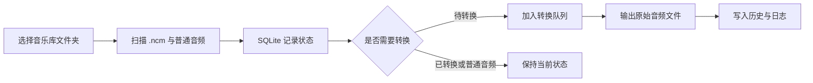

# NCM 音乐库转换器


这是一个基于 [lissettecarlr/ncmdump](https://github.com/lissettecarlr/ncmdump) 改造和扩展的 NCM 音乐库转换工具。

原项目提供 `.ncm` 音频文件转换能力，并包含 Windows 客户端与 Web 使用方式。本项目在保留 NCM 转换核心逻辑的基础上，重点扩展了桌面端音乐库管理体验：音乐库扫描、转换状态记忆、增量转换队列、历史日志、设置管理、深色主题和本地语言分类实验页。


## 项目来源与改造说明

| 部分 | 说明 |
| --- | --- |
| 转换核心 | 来自/基于 `lissettecarlr/ncmdump` 的 NCM 解密转换逻辑。 |
| 基础运行方式 | 延续原项目的 Python、PyQt6、Streamlit 和 Docker 运行思路。 |
| 本项目扩展 | 增加音乐库扫描、SQLite 状态持久化、增量转换、队列控制、历史日志、主题设置、本地语言分类等桌面端能力。 |
| 许可归属 | 上游项目为 MIT License；二次发布时应保留上游版权和许可说明。 |


## 功能概览

| 模块 | 说明 |
| --- | --- |
| 音乐库扫描 | 选择一次音乐库文件夹，应用会递归扫描 `.ncm` 和普通音频文件。 |
| 状态记忆 | 使用 SQLite 保存文件状态、输出路径、失败原因、历史记录和设置。 |
| 增量转换 | 只转换仍处于待处理状态的 `.ncm` 文件，避免重复处理已完成内容。 |
| 队列控制 | 支持全部转换、多选转换、单个转换、暂停、继续、取消和失败重试。 |
| 历史与日志 | 查看转换结果、失败信息，并可导出日志文本。 |
| 本地语言分类 | V2.1 新增实验页，基于文件名和目录文本推断中文、英文、日文、韩文、混合、其他和未知类别。 |
| 外观设置 | 默认 Obsidian 深色主题，并保留深色、浅色、舒适和紧凑密度选项。 |
| Web 上传转换 | 保留 Streamlit Web 入口，适合临时上传少量 NCM 文件后下载结果。 |

本项目不引入 `ffmpeg`，也不进行强制转码。工具会尽量还原 NCM 文件内部已有的原始音频流；如果源文件内部是 MP3，输出就是 MP3；如果源文件内部是 FLAC，输出就是 FLAC。

## 界面流程



## Windows 用户使用

如果你只想使用成品程序：

1. 在 GitHub Releases 下载 `ncmdump-V2.1-windows.zip`。
2. 解压压缩包。
3. 双击 `NCM Converter.exe` 启动。
4. 首次启动后选择你的音乐库文件夹。
5. 扫描完成后点击“转换待处理”。

如果 Windows SmartScreen 提示未知发布者，选择“更多信息”后继续运行。该提示通常是因为程序没有商业代码签名证书。

## 从源码运行

建议使用 Python 3.11 或更新版本。

```powershell
python -m venv .venv
.\.venv\Scripts\Activate.ps1
python -m pip install -r requirements.txt
```

启动桌面应用：

```powershell
python gui.py
```

启动 Web 上传转换页面：

```powershell
streamlit run web.py --server.port 1111 --server.maxUploadSize=500
```

## Docker Web 服务

容器模式只提供 Web 上传转换，不提供 PyQt6 桌面界面。

```powershell
docker build -t ncmdump:2.1 .
docker run --rm -p 23231:23231 --name ncmdump-web ncmdump:2.1
```

启动后访问：

```text
http://localhost:23231
```

## 打包 Windows 可执行文件

```powershell
pyinstaller --onefile --add-data="file:file" -wF -i file/favicon-32x32.png -n "NCM Converter" .\gui.py
```

打包完成后，可执行文件位于：

```text
dist\NCM Converter.exe
```

## 本地数据位置

桌面端会把扫描状态和设置保存到本地 SQLite 数据库。

| 项目 | 路径 |
| --- | --- |
| Windows 默认数据库 | `%APPDATA%\ncmdump\ncmdump.sqlite3` |
| 测试覆盖路径 | 设置环境变量 `NCMDUMP_DB_PATH` |
| Web 临时目录 | `temp\` |

数据库中会记录音乐库路径、相对文件路径、大小、修改时间、指纹、状态、输出路径、转换历史、失败原因、设置和日志。

## 测试

运行服务层单元测试：

```powershell
python -m unittest discover -s tests
```

运行语法检查：

```powershell
python -m py_compile gui.py web.py ncmdump\core.py ncmdump\__init__.py ncmdump\models.py ncmdump\i18n.py ncmdump\library_db.py ncmdump\library_scanner.py ncmdump\conversion_queue.py
```

V2.1 本地验证记录：

- 单元测试通过：`18 tests OK`
- 语法检查通过
- Qt offscreen 启动检查通过，确认默认 `obsidian` 主题和 5 个侧边栏页面可初始化

## 常见问题

**这个项目和 lissettecarlr/ncmdump 是什么关系？**  
本项目的 NCM 转换核心基于 [lissettecarlr/ncmdump](https://github.com/lissettecarlr/ncmdump)。本项目主要是在其基础上扩展桌面端音乐库管理、状态持久化、批量队列和新版 UI。

**转换后为什么不是 FLAC？**  
工具不会转码，只会解密 NCM 内部已有的音频流。如果源文件内部是 MP3，输出就是 MP3。

**可以批量转换整个音乐库吗？**  
可以。桌面端选择音乐库后执行扫描，再点击“转换待处理”。应用会跳过已转换或无需转换的文件。

**删除源 NCM 是否安全？**  
设置里有“成功后删除源 NCM”选项，但这是不可逆操作。建议确认输出文件无误并做好备份后再开启。

**语言分类会联网吗？**  
不会。V2.1 的语言分类实验功能只基于本地文件名和目录文本进行 Unicode 脚本推断。

## 致谢

感谢 [lissettecarlr/ncmdump](https://github.com/lissettecarlr/ncmdump) 提供 NCM 转换实现和原始项目基础。

## 许可说明

上游项目 `lissettecarlr/ncmdump` 使用 MIT License。基于该项目继续分发、修改或发布时，应保留其版权声明和许可文本。


## 免责声明

本项目仅用于学习、研究和个人本地文件处理。请确保你对要处理的音乐文件拥有合法使用权，并遵守所在地区的法律法规和相关平台服务条款。
