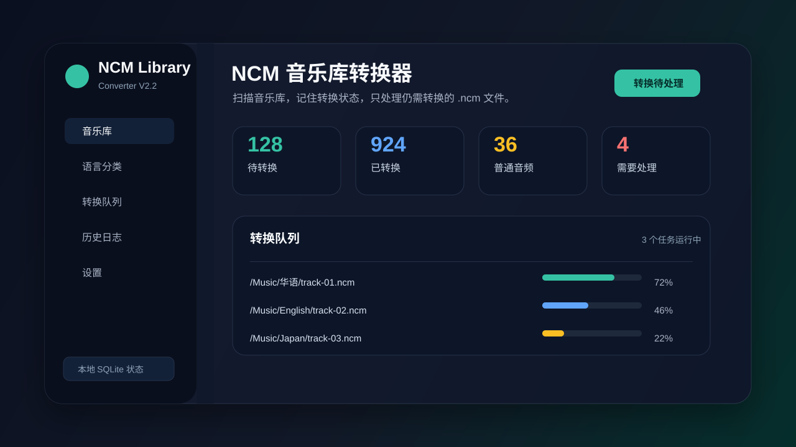
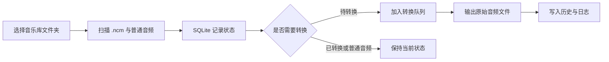

# NCM 音乐库转换器




这是一个基于 [lissettecarlr/ncmdump](https://github.com/lissettecarlr/ncmdump) 改造和扩展的 NCM 音乐库转换工具。

原项目提供 `.ncm` 音频文件转换能力，并包含 Windows 客户端与 Web 使用方式。本项目在保留 NCM 转换核心逻辑的基础上，扩展了桌面端音乐库管理体验。V3.0 进一步重构了“音乐库、任务、历史、设置”主流程，并重点修复扫描/转换竞态、取消残留文件、进度抖动和文件定位不准确等可靠性问题。

## 项目来源与改造说明

| 部分 | 说明 |
| --- | --- |
| 转换核心 | 来自/基于 `lissettecarlr/ncmdump` 的 NCM 解密转换逻辑。 |
| 基础运行方式 | 延续原项目的 Python、PyQt6、Streamlit 和 Docker 运行思路。 |
| 本项目扩展 | 增加音乐库扫描、SQLite 状态持久化、增量转换、队列控制、转换摘要、失败分组、历史日志、主题设置、本地语言分类等桌面端能力。 |
| 许可归属 | 上游项目为 MIT License；二次发布时应保留上游版权和许可说明。 |

如果你准备把仓库发布到 GitHub，建议在仓库中保留或补充 `LICENSE` 文件，并在其中包含上游 MIT 许可声明。

## 功能概览

| 模块 | 说明 |
| --- | --- |
| 音乐库扫描 | 选择一次音乐库文件夹，应用会递归扫描 `.ncm` 和普通音频文件。 |
| 状态记忆 | 使用 SQLite 保存文件状态、输出路径、失败原因、历史记录和设置；V2.x 数据会原位升级。 |
| 增量转换 | 只转换仍处于待处理状态的 `.ncm` 文件，避免重复处理已完成内容。 |
| 队列控制 | 支持全部转换、多选转换、单个转换、暂停、继续、取消和失败重试。 |
| 转换摘要 | “任务”页显示转换、跳过、失败、未处理数量、耗时和输出位置，并提供打开输出、重试失败和导出日志操作。 |
| 失败分组 | “任务”页按权限、输出目录、源文件缺失、磁盘空间、格式异常等原因聚合失败项。 |
| 历史与日志 | 查看转换结果、失败信息，并可导出日志文本。 |
| 本地语言分类 | “工具”中的实验页基于文件名和目录文本推断中文、英文、日文、韩文、混合、其他和未知类别。 |
| FLAC 转 MP3 | “工具”提供独立的拖放/选择界面，不显示音乐库重扫和批量转换控件；可加入单个或多个 FLAC，也可递归发现文件夹内容。支持 128–320 kbps、同目录或自定义输出、标签与封面复制、进度、取消和已有文件处理。转换完成后可右键在文件夹中精确定位 MP3，原 FLAC 始终保留。 |
| 外观设置 | 默认现代专业深色主题，并提供完整浅色主题；旧 `obsidian`、`dark` 设置自动映射到新版深色主题。 |
| 界面交互 | 选择文件后搜索栏仍然常驻；批量操作只切换第二行；任务标题、当前文件、统计和控制按钮使用互不覆盖的固定区域；全局滚动条统一为圆角轨道与平滑滑块；转换终态会自动清空本批勾选。 |
| 可靠任务 | 扫描与转换严格互斥；完整扫描原子提交；转换使用同目录临时文件并在成功后原子发布。 |
| 精确定位 | Windows 会在资源管理器中直接选中源文件；FLAC 工具的完成项可右键精确选中实际生成的 MP3；macOS 使用 Finder 定位；Linux 优先请求文件管理器显示目标。转换摘要的“打开输出目录”仍只打开目录。 |
| Web 上传转换 | 保留 Streamlit Web 入口，适合临时上传少量 NCM 文件后下载结果。 |

NCM 主流程不引入 `ffmpeg`，也不进行强制转码：如果 NCM 内部是 MP3，解密输出就是 MP3；内部是 FLAC，输出就是 FLAC。只有当你主动打开“工具 → FLAC → MP3”并添加文件时，独立工具才会使用随程序打包的本地解码与 LAME 编码组件生成 MP3，且不会删除原 FLAC。

## 界面流程



## Windows 用户使用

如果你只想使用成品程序：

1. 在 GitHub Releases 下载 `NCM-Library-Converter-V3.0-windows.zip`。
2. 解压压缩包。
3. 双击 `NCM Converter.exe` 启动。
4. 首次启动后选择你的音乐库文件夹。
5. 扫描完成后点击“转换待处理”。

如需将已有 FLAC 制作为 MP3 副本，打开“工具 → FLAC → MP3”，把文件/文件夹拖入页面或点击选择，确认音质与输出位置后开始转换。完成后右键列表项目并选择“在文件夹中显示 MP3”，即可打开文件管理器并定位到实际输出文件。

如果 Windows SmartScreen 提示未知发布者，选择“更多信息”后继续运行。该提示通常是因为程序没有商业代码签名证书。

## 从源码运行

建议使用 Python 3.11 或更新版本。

```powershell
python -m venv .venv
.\.venv\Scripts\Activate.ps1
python -m pip install -r requirements.txt
```

启动桌面应用：

```powershell
python gui.py
```

启动 Web 上传转换页面：

```powershell
streamlit run web.py --server.port 1111 --server.maxUploadSize=500
```

## Docker Web 服务

容器模式只提供 Web 上传转换，不提供 PyQt6 桌面界面。

```powershell
docker build -t ncmdump:3.0 .
docker run --rm -p 23231:23231 --name ncmdump-web ncmdump:3.0
```

启动后访问：

```text
http://localhost:23231
```

## 打包 Windows 可执行文件

```powershell
pyinstaller --onefile --add-data="file:file" -wF -i file/favicon-32x32.png -n "NCM Converter" .\gui.py
```

打包完成后，可执行文件位于：

```text
dist\NCM Converter.exe
```

## 本地数据位置

桌面端会把扫描状态和设置保存到本地 SQLite 数据库。

| 项目 | 路径 |
| --- | --- |
| Windows 默认数据库 | `%APPDATA%\ncmdump\ncmdump.sqlite3` |
| 测试覆盖路径 | 设置环境变量 `NCMDUMP_DB_PATH` |
| Web 临时目录 | `temp\` |

数据库中会记录音乐库路径、相对文件路径、大小、修改时间、指纹、状态、输出路径、转换历史、失败原因、设置和日志。

## 测试

运行服务层单元测试：

```powershell
python -m unittest discover -s tests
```

运行语法检查：

```powershell
python -m py_compile gui.py web.py ncmdump\core.py ncmdump\audio_transcoder.py ncmdump\desktop_app.py ncmdump\models.py ncmdump\i18n.py ncmdump\library_db.py ncmdump\library_scanner.py ncmdump\conversion_queue.py ncmdump\platform_integration.py ncmdump\task_controller.py
```

V3.0 建议验证项：

- 单元测试：`python -m unittest discover -s tests`
- 语法检查：确认 `gui.py`、`web.py` 和 `ncmdump` 模块可编译
- Qt offscreen 启动检查：确认深浅主题、“音乐库/任务/历史/设置”主导航和“工具/语言分类/FLAC → MP3”可初始化
- Qt 交互检查：确认选择与转换终态不会移动表格，搜索栏始终可见，转换完成后本批勾选归零
- 发布包检查：确认 ZIP 包含 `NCM Converter.exe`、`VERSION`、`LICENSE`、发行说明和分发说明

## 常见问题

**这个项目和 lissettecarlr/ncmdump 是什么关系？**
本项目的 NCM 转换核心基于 [lissettecarlr/ncmdump](https://github.com/lissettecarlr/ncmdump)。你的项目主要是在其基础上扩展桌面端音乐库管理、状态持久化、批量队列和新版 UI。

**转换后为什么不是 FLAC？**
工具不会转码，只会解密 NCM 内部已有的音频流。如果源文件内部是 MP3，输出就是 MP3。

**FLAC 转 MP3 是否需要安装 FFmpeg？会删除原文件吗？**
不需要。桌面便携包会携带所需的本地解码和 LAME 编码组件；该独立工具始终保留原 FLAC，已有 MP3 默认跳过，只有关闭“跳过已有 MP3”后才会替换目标文件。

**可以批量转换整个音乐库吗？**
可以。桌面端选择音乐库后执行扫描，再点击“转换待处理”。应用会跳过已转换或无需转换的文件。

**转换失败后怎么处理？**
V3.0 会在“任务”页按失败原因分组。你可以展开详情、精确定位源文件，或直接重试某一组失败文件。

**删除源 NCM 是否安全？**
设置里有“成功后删除源 NCM”选项，但这是不可逆操作。建议确认输出文件无误并做好备份后再开启。

**语言分类会联网吗？**
不会。V3.0 的语言分类实验功能只基于本地文件名和目录文本进行 Unicode 脚本推断。

**Web 版适合替代桌面版吗？**
不适合。Web 版更适合临时上传少量文件；管理大型音乐库建议使用桌面端。

## 致谢

感谢 [lissettecarlr/ncmdump](https://github.com/lissettecarlr/ncmdump) 提供 NCM 转换实现和原始项目基础。

## 许可说明

上游项目 `lissettecarlr/ncmdump` 使用 MIT License。基于该项目继续分发、修改或发布时，应保留其版权声明和许可文本。

本仓库中你新增的改造代码可继续按 MIT License 发布，或按你自己的发布策略补充说明；如果继续使用上游转换核心，建议保持 MIT 许可声明清晰可见。

## GitHub Release 检查清单

- `VERSION` 更新为 `V3.0`
- `LICENSE` 保留在仓库根目录
- `RELEASE_NOTES_V3.0.md` 已更新
- `DISTRIBUTION_README_V3.0.txt` 已更新
- Windows 压缩包命名为 `NCM-Library-Converter-V3.0-windows.zip`
- README 顶部图文预览 `docs/readme-preview.svg` 可在 GitHub 正常显示

## 免责声明

本项目仅用于学习、研究和个人本地文件处理。请确保你对要处理的音乐文件拥有合法使用权，并遵守所在地区的法律法规和相关平台服务条款。
